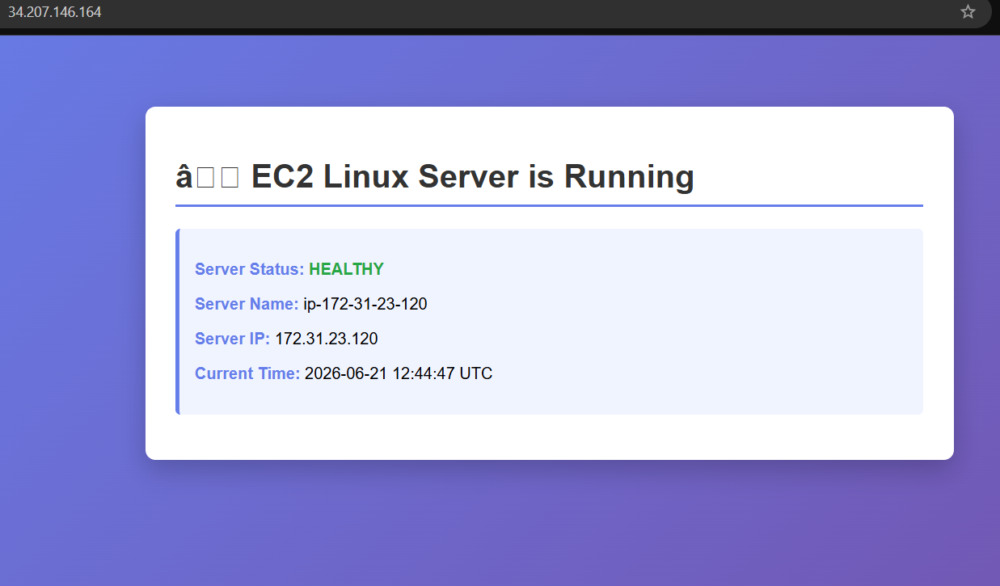

# Project 2: Linux Server Setup on EC2

## Overview

A secure EC2 instance is the foundation of many AWS workloads. In this project you will use the AWS Management Console to launch a hardened Linux server with best practices built in. This includes creating security groups, IAM roles, key pairs, and deploying a Python Flask web application through the EC2 user data script. No AWS CLI is required for the console-based steps; an optional CLI/automation section is provided at the end.

## Prerequisites

Before starting this project, ensure you have:

1. An AWS account with EC2 and IAM console access
2. A web browser to access the AWS Management Console
3. Access to the project files: `app.py`, `requirements.txt`, and `user-data.sh`
4. Basic Linux and networking knowledge
5. Optional: an SSH client for direct SSH access (Session Manager is also available)

## Project Structure

```
AWS Project 2 - Linux Server Setup on EC2/
├── app.py            # Flask web application
├── requirements.txt  # Python dependencies
├── user-data.sh      # EC2 user data startup script
├── deploy.sh         # Automated CLI deployment script
├── cleanup.sh        # Automated CLI cleanup script
└── README.md
```

## Steps

### 1. Create an EC2 Security Group

1. Open the AWS Console and navigate to EC2 Dashboard.
2. In the left sidebar, click Security Groups under "Network & Security".
3. Click Create security group.
4. Enter:
   - Security group name: `project2-web-server-sg`
   - Description: `Security group for Project 2 EC2 web server`
   - VPC: Select your default VPC
5. Under Inbound rules, add three rules:
   - SSH | Port 22 | Source: your IP address (or `0.0.0.0/0` for testing only)
   - HTTP | Port 80 | Source: `0.0.0.0/0`
   - HTTPS | Port 443 | Source: `0.0.0.0/0`
6. Click Create security group.

### 2. Create an IAM Role for EC2 

1. Open the AWS Console and navigate to IAM Dashboard.
2. Click Roles in the left sidebar, then Create role.
3. Select AWS service and choose EC2. Click Next.
4. Attach the following policies:
   - `CloudWatchAgentServerPolicy`
   - `AmazonSSMManagedInstanceCore`
5. Click Next, enter the role name `Project2-EC2-Role`, then click Create role.

### 3. Create an EC2 Key Pair

1. In the EC2 Console, click Key Pairs under "Network & Security".
2. Click Create key pair.
3. Enter:
   - Name: `project2-key`
   - Key pair type: RSA
   - Private key file format: `.pem`
4. Click Create key pair and save `project2-key.pem` securely.

### 4. Launch the EC2 Instance

1. In the EC2 Dashboard, click Launch instances.
2. Configure:
   - Name: `Project2-Web-Server`
   - AMI: Ubuntu Server 24.04 LTS
   - Instance type: `t2.micro` or `t3.micro`
   - Key pair: `project2-key`
   - Network settings: default VPC, security group `project2-web-server-sg`
   - Auto-assign public IP: Enable
3. Scroll to Advanced details:
   - IAM instance profile: `Project2-EC2-Role`
   - User data: paste the contents of `user-data.sh` or upload the file of `user-data.sh`
4. Click Launch instance.

### 5. Monitor Instance Startup

1. In EC2 Dashboard, click Instances.
2. Select `Project2-Web-Server`.
3. Wait for:
   - Instance state: Running
   - Status checks: 2/2 or 3/3 passed
4. Copy the Public IPv4 address from the instance details panel.

### 6(a). Connect to the Instance via Session Manager 

1. In the EC2 Dashboard, select the instance.
2. Click Connect.
3. Choose Session Manager and click Connect.
4. A browser-based terminal opens with no SSH key required.

#### OR

### 6(b). Connect to the Instance via SSH (EC2 Instance Connect)

#### SSH from Your Laptop (Step by Step)
1. Locate your .pem key file. Copy the location of the file ( e.g. project2-key.pem).
2. Copy the public IP address from EC2 instance. EC2 Console → Instances → your instance → copy Public IPv4.
3. *Connect via SSH:* Opne the CMD or windows power shell and type: 
```bash
ssh -i "path\to\project2-key.pem" ubuntu@<YOUR_PUBLIC_IP>
```
Use *ubuntu* as username since you're on Ubuntu 24.04
4. Type yes when asked to confirm the fingerprint.
5. Run the following command after the connection is established to Ensure webapp config is linked:
```bash
sudo ln -sf /etc/nginx/sites-available/webapp /etc/nginx/sites-enabled/webapp
```
6. Test and restart the Engine:
```bash
sudo nginx -t
sudo systemctl restart nginx
```


### 7. Access the Web Application

1. Open a browser tab and enter `http://<PUBLIC_IP>`.
2. Confirm the application shows:
   - Server Status: HEALTHY
   - Server Name
   - Server IP
   - Current Time



### 8. Monitor Metrics in CloudWatch

1. Open CloudWatch Console
2. In left sidebar click "Metrics" → "All metrics"
3. Click "EC2"
4. Click "Per-Instance Metrics"
5. Search your instance ID (e.g. i-0abc123...)
6. Review metrics: CPU utilization, network, disk I/O, and status check failures.

## 9. Scale to multiple instances with Load Balancer (Optional)
### Architecture
```bash
Internet
    ↓
Load Balancer (port 80)
    ↓
Target Group
  ├── EC2 Instance 1 (Flask app)
  ├── EC2 Instance 2 (Flask app)
  └── EC2 Instance 3 (Flask app)
```
### Step 1 — Create an AMI from Your Running Instance
In AWS EC2, an **Image** means an AMI (Amazon Machine Image).An AMI is like a pre-made blueprint or copy of a computer in the cloud.

It contains everything needed to start an EC2 instance, so you don't need to install/configure eac insance every time, such as:

   - Operating system (Linux or Windows)
   - Pre-installed software (like Nginx, Apache, etc.)
   - Settings and configuration
   - Sometimes your own custom files
EC2 Image (AMI) = template used to create servers quickly in AWS.

Since your Flask app is already working, create an **image** so you don't repeat setup:
1. Go to EC2 → Instances
2. Select Project2-Web-Server
3. Click Actions → Image and templates → Create image
4. Enter:
    - Image name: project2-webapp-ami
    - Description: Flask web app AMI
5. Click Create image
6. Wait for it to show Available under EC2 → AMIs

*This captures your entire server setup so new instances launch ready-to-go.*

### Step 2 — Create a Target Group
A **Target Group** in an Application Load Balancer (ALB) is a *set of backend servers (EC2 instances)* that receive traffic from the load balancer. 
So all the Instances which are set to recieve traffic of any pirticular instance are grouped together in Target Group. So if any instance instance fails of target group ALB divert the traffic to another instance in the Target group.


**What it does:**
When a user requests your application:
1. Request goes to the ALB
2. ALB checks the Target Group
3. It forwards the request to one of the healthy EC2 instances inside that group.

1. Go to EC2 → Target Groups in left sidebar
2. Click Create target group
3. Configure:
   - Target type: Instances
   - Target group name: project2-tg
   - Protocol: HTTP
   - Port: 80
   - VPC: your default VPC
4. Under Health checks:

   - Protocol: HTTP
   - Health check path: /health
5. Click Next
6. Don't add instances yet — click Create target group

### Step 3 — Launch Additional EC2 Instances
Launch 2 more instances using your AMI:

1. Go to EC2 → Instances → Launch instances
2. Configure:
   - Name: Project2-Web-Server-2
   - AMI: Click My AMIs → select project2-webapp-ami
   - Instance type: t2.micro
   - Key pair: project2-key
   - Security group: project2-web-server-sg
   - Auto-assign public IP: Enable
   - IAM role: Project2-EC2-Role


3. **Number of instances**: 2
4. Click **Launch instance**
*Wait for both instances to show 2/2 status checks before proceeding.*

### Step 4 — Register Instances in Target Group

1. Go to EC2 → Target Groups
2. Select project2-tg
3. Click Targets tab → Register targets
4. Select all 3 instances (original + 2 new)
5. Click Include as pending below
6. Click Register pending targets

Wait until all targets show **Healthy** status.

### Step 5 — Create Application Load Balancer

1. Go to EC2 → Load Balancers → Create load balancer
2. Select Application Load Balancer
3. Configure:
   - Name: project2-alb
   - Scheme: Internet-facing
   - IP address type: IPv4
4. Under Network mapping:
   - VPC: default VPC
   - Select at least 2 Availability Zones (required). It is important that you must select the same AZ for the ALB as where your EC2 instances are. AZ for the EC2 and ALb must be same
5. Under Security groups:
   - Remove default
   - Add project2-web-server-sg
6. Under Listeners and routing:
   - Protocol: HTTP Port: 80
   - Default action: Forward to project2-tg

Click **Create load balancer**

### Step 6 — Test the Load Balancer

1. Go to EC2 → Load Balancers
2. Select project2-alb
3. Copy the DNS name (looks like project2-alb-123456.us-east-1.elb.amazonaws.com)
4. Open in browser:
```bash
http://DNS_Name
```
5. Keep refreshing — you'll see Server Name and Server IP changing as ALB routes to different instances.


### Step 7 - Cleanup (When Done)
Delete in this order to avoid dependency errors:

1. Delete Load Balancer
2. Delete Target Group
3. Terminate extra EC2 instances (keep original if you want)
4. Deregister/Delete AMI if no longer needed

## Console Deployment

Steps 1–9 above are the complete AWS Management Console deployment path. Use this quick reference and cleanup guide alongside them.

### Quick Reference

| Step | Service | Action |
|------|---------|--------|
| 1 | EC2 → Security Groups → Create | Name: `project2-web-server-sg`, add SSH/HTTP/HTTPS inbound rules |
| 2 | IAM → Roles → Create role | AWS service → EC2, attach `CloudWatchAgentServerPolicy` + `AmazonSSMManagedInstanceCore`, name: `Project2-EC2-Role` |
| 3 | EC2 → Key Pairs → Create | Name: `project2-key`, RSA, .pem format — save securely |
| 4 | EC2 → Launch instances | Ubuntu 22.04, t2.micro, attach key pair + SG + IAM role, paste `user-data.sh` in Advanced details |
| 5 | EC2 → Instances | Wait for 2/2 status checks, copy Public IPv4 address |
| 6 | Browser | Open `http://<PUBLIC_IP>` and confirm healthy response |
| 7 | EC2 → Connect → Session Manager | Browser terminal, no SSH key required |
| 8 | CloudWatch → Instances | Review CPU, network, disk metrics |

### Console Cleanup

1. Go to **EC2 → Instances** → select `Project2-Web-Server` → **Instance state → Terminate instance**
2. Wait for termination, then go to **EC2 → Security Groups** → delete `project2-web-server-sg`
3. Go to **EC2 → Key Pairs** → delete `project2-key`
4. Go to **IAM → Roles** → delete `Project2-EC2-Role`

---


## Testing and Validation

After deployment, validate the setup:

1. Open `http://<PUBLIC_IP>` in your browser and confirm the application responds.
2. Test the health endpoint: `curl http://<PUBLIC_IP>/health`
3. Verify SSH key authentication works: `ssh -i web-server-key.pem ec2-user@<PUBLIC_IP>`
4. Confirm password authentication is rejected (SSH hardening).
5. Check instance status in the EC2 Console (2/2 status checks should pass).
6. Review `cat /var/log/cloud-init-output.log` via Session Manager OR SSH terminal if the app does not start.

## Learning Objectives

After completing this project, you will understand:

- Launching EC2 instances using the AWS Console
- Creating and managing security groups
- Assigning IAM roles to EC2 instances
- Using key pairs for secure SSH access
- Automating server configuration with EC2 user data
- Checking instance health and metrics in CloudWatch
- Using Session Manager for secure browser-based terminal access


