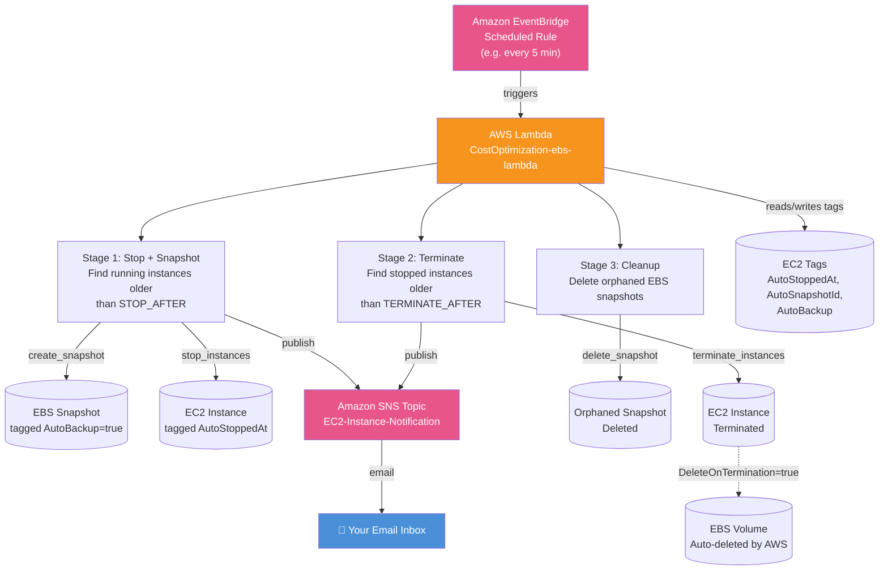

# CostOptimization-EBS-Lambda

An automated AWS cost-optimization pipeline that stops idle EC2 instances, snapshots their data before stopping, terminates long-stopped instances, cleans up orphaned EBS snapshots, and sends real-time email notifications for every action — all serverless, running on a schedule.

---

## Table of Contents

- [Introduction](#introduction)
- [Architecture](#architecture)
- [How It Works](#how-it-works)
- [Prerequisites](#prerequisites)
- [Setup Guide](#setup-guide)
  - [1. Create the Lambda Function](#1-create-the-lambda-function)
  - [2. Configure IAM Permissions](#2-configure-iam-permissions)
  - [3. Set Up the EventBridge Schedule](#3-set-up-the-eventbridge-schedule)
  - [4. Set Up SNS Email Notifications](#4-set-up-sns-email-notifications)
  - [5. Wire the SNS Topic into the Code](#5-wire-the-sns-topic-into-the-code)
- [Configuration](#configuration)
- [Testing](#testing)
- [Tagging Reference](#tagging-reference)
- [Notifications Reference](#notifications-reference)
- [Known Behaviors & Notes](#known-behaviors--notes)
- [Project Structure](#project-structure)

---

## Introduction

This project solves a common AWS cost problem: **EC2 instances and EBS snapshots that are left running or lying around long after they're needed**, quietly generating cost.

Instead of manually watching instances or writing a script you have to remember to run, this project uses:

- **AWS Lambda** — a serverless function containing all the cleanup logic, so there's no server to maintain.
- **Amazon EventBridge (Scheduled Rule)** — triggers the Lambda automatically on a fixed interval (e.g., every 5 minutes), acting as the "heartbeat" that drives the whole workflow. Lambda itself is stateless and can't "wait" for hours or days inside a single invocation, so EventBridge is what makes long-duration behavior (like "wait 1 hour" or "wait 1 week") possible — each invocation just checks timestamps stored in tags and picks up where the last one left off.
- **Amazon SNS (Simple Notification Service)** — sends an email notification for every meaningful event (snapshot created, instance stopped, instance terminated, snapshot deleted), so you always know what the automation is doing without checking the console.
- **EC2 tags** — used as lightweight persistent state, since Lambda has no memory between runs.

## Architecture



**Flow summary:**

1. EventBridge fires the Lambda on a schedule.
2. The Lambda checks all running instances — any older than `STOP_AFTER` gets its volumes snapshotted, then gets stopped, then gets tagged with the timestamp.
3. On a later run, the Lambda checks all stopped instances — any `stopped_duration >= TERMINATE_AFTER` gets terminated (its volume is auto-deleted by AWS via `DeleteOnTermination=true`. No need to delete the Volume separately).
4. The Lambda also cleans up any EBS snapshot that's orphaned (no volume, or volume not attached to a running instance) — except snapshots explicitly tagged as intentional backups.
5. Every stop/terminate/snapshot/cleanup action triggers an SNS email notification.

## How It Works

Since Lambda executions are short-lived (max 15 minutes) and stateless, this project uses **EC2 tags as persistent state** rather than trying to keep a function "waiting":

| Stage | Trigger Condition | Action |
|---|---|---|
| **1. Stop + Snapshot** | Instance is `running` and `now - LaunchTime >= STOP_AFTER` | Snapshot every attached volume → stop the instance → tag it `AutoStoppedAt=<timestamp>` |
| **2. Terminate** | Instance is `stopped`, tagged `AutoStoppedAt`, and `now - AutoStoppedAt >= TERMINATE_AFTER` | Terminate the instance (attached volumes auto-delete via `DeleteOnTermination=true`) |
| **3. Cleanup** | Snapshot has no volume, or its volume isn't attached to a running instance, and it's **not** tagged `AutoBackup=true` | Delete the orphaned snapshot |

Every time EventBridge triggers the Lambda, all three stages run in sequence, each independently checking the current state of your EC2 resources.

# PROJECT SETUP

## Prerequisites

- An AWS account with permissions to create Lambda functions, IAM policies, EventBridge rules, and SNS topics.
- Python 3.x runtime (Lambda).
- `boto3` (included by default in the AWS Lambda Python runtime — no extra layer needed).
- At least one EC2 instance to test against.

## Setup Guide

### 1. Create the Lambda Function

1. Go to **Lambda Console → Create function**.
2. Choose **Author from scratch**.
3. **Function name**: `CostOptimization-ebs-lambda`
4. **Runtime**: Python 3.x (latest available)
5. Paste the script from [`lambda_function.py`](#project-structure) into the code editor.
6. Set the **Timeout** (Configuration → General configuration) to at least **2-3 minutes**, since `create_snapshot` and multiple `describe_*` calls add latency.

### 2. Configure IAM Permissions

1. Go to your function → **Configuration → Permissions** → click the execution role link.
2. Add Permissions → Create Inline Policy. Paste the following code:

```json
{
  "Version": "2012-10-17",
  "Statement": [
    {
      "Sid": "EC2LifecycleManagement",
      "Effect": "Allow",
      "Action": [
        "ec2:DescribeInstances",
        "ec2:DescribeSnapshots",
        "ec2:DescribeVolumes",
        "ec2:CreateSnapshot",
        "ec2:CreateTags",
        "ec2:StopInstances",
        "ec2:TerminateInstances",
        "ec2:DeleteSnapshot",
        "ec2:DeleteVolume"
      ],
      "Resource": "*"
    },
    {
      "Sid": "SNSPublish",
      "Effect": "Allow",
      "Action": "sns:Publish",
      "Resource": "arn:aws:sns:REGION:ACCOUNT_ID:EC2-Instance-Notification" 
    }
  ]
}
```
In the Resource, Paste your ARN here.

3. Make sure **`AWSLambdaBasicExecutionRole`** (AWS managed policy) is also attached — this grants CloudWatch Logs permissions so `print()` output is visible.

### 3. Set Up the EventBridge Schedule

1. Go to **Amazon EventBridge → Rules → Create rule** (or use **Scheduled rule** from the "Get started" panel).
2. **Name**: `ebs-lifecycle-heartbeat`
3. **Rule type**: Schedule → Rate expression → e.g. `5 minutes` (for testing) or `1 hour` (for production).
4. **Target**: AWS Lambda → select `CostOptimization-ebs-lambda`.
5. Create the rule — it appears as a trigger on your Lambda's function diagram.

> Do **not** use the "Add destination" feature on the Lambda — that only fires on async invocation failures and is unrelated to the in-code SNS notifications this project uses.


### 4. Set Up SNS Email Notifications

1. Go to **SNS Console → Topics → Create topic**.
2. **Type**: Standard
3. **Name**: `EC2-Instance-Notification`
4. Create the topic and copy its **Topic ARN**.
5. On the topic page → **Create subscription** → **Protocol**: Email → **Endpoint**: your email address.
6. Check your inbox and click **Confirm subscription** (Also, check the spam folder if not in the inbox) — the subscription must show **Confirmed** in the console, or emails won't be delivered even if publishing succeeds.


### 5. Wire the SNS Topic into the Code

In the script, set:

```python
SNS_TOPIC_ARN = 'arn:aws:sns:REGION:ACCOUNT_ID:EC2-Instance-Notification' 
```
Paste your ARN here

Use the **Topic ARN** (not a subscription ARN — the topic ARN has no trailing UUID suffix).

## Configuration

Chnages these values for testing.

```python
STOP_AFTER = timedelta(minutes=5)      # how long an instance can run before it's stopped
TERMINATE_AFTER = timedelta(hours=24)  # how long an instance can stay stopped before termination
```

| Environment | STOP_AFTER | TERMINATE_AFTER |
|---|---|---|
| **Testing** (current) | `minutes=5` | `minutes=15` |
| **Production** | `hours=1` | `days=7` |

Swap these two lines to move between testing and production — no other code changes needed.

## Testing

1. Go to your Lambda function → **Test** tab.
2. Create a test event (the function ignores the `event` payload, so any default JSON works).
3.  Click **Save** button and come to code section again.
3. Click **Test** (below the **Deploy Code** button)and check the logs panel for success/failure.
4. Check **CloudWatch Logs** (Monitor tab → View CloudWatch logs) for detailed `print()` output of every action taken.
5. Check your email for SNS notifications.

**To test the termination + cleanup stages without waiting 24 hours:** Test it again after 15-20 mins after the instance is stopped, it should terminate the instance and volumme will also be automatically deleted.


## Tagging Reference

| Tag Key | Set On | Purpose |
|---|---|---|
| `AutoStoppedAt` | EC2 Instance | ISO timestamp of when the instance was auto-stopped; used to calculate stopped duration for the termination stage |
| `AutoSnapshotId` | EC2 Instance | Comma-separated list of snapshot IDs created before stopping |
| `AutoBackup` | EBS Snapshot | Marks a snapshot as an intentional backup so the cleanup stage never deletes it |

## Notifications Reference

| Event | Subject |
|---|---|
| Snapshot created before stopping | `EBS Snapshot Created` |
| Instance stopped | `EC2 Instance Stopped` |
| Instance terminated | `EC2 Instance Terminated` |

All notifications are sent via the `notify()` helper, which wraps `sns.publish()` in a try/except — an SNS failure never breaks the underlying EC2 cleanup logic.

## Known Behaviors & Notes

- **`DeleteOnTermination`**: Root volumes typically default to `true`, meaning AWS deletes them automatically on instance termination — no manual volume-deletion code is needed in that case. This project relies on that default rather than manually deleting volumes.
- **Backup snapshots are protected**: Snapshots tagged `AutoBackup=true` are always skipped by the orphaned-snapshot cleanup stage, so your pre-stop backups are never accidentally deleted in the same run that terminates their source instance.
- **Idempotency**: The stop stage checks for the `AutoStoppedAt` tag before acting, so an instance already processed won't be snapshotted or stopped again on the next run.

## Project Structure

```
AWS Cost Optimization Pipeline
├── lambda_function.py   # Main Lambda handler and all stage logic
└── README.md             
```